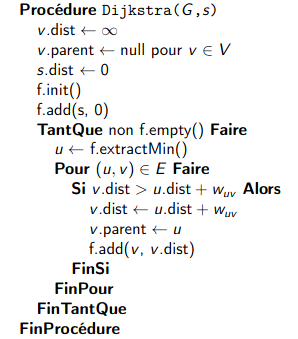
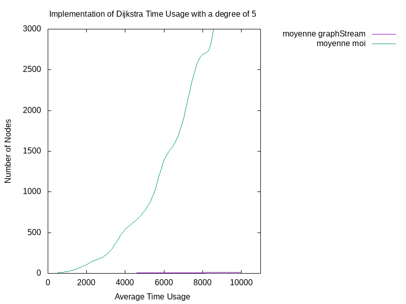

# Dijkstra

L'algorithme de Dijkstra est un algorithme de calcul de chemin le plus rapide d'un noeud source, vers tous les autres noeuds d'un graph.
Nous verrons dans ce document un comparatif des temps d'exécution entre mon implémentation de l'algorithme de Dijkstra et celle de GraphStream.

L'algorithme fonctionne en affinant, au fur et à mesure de l'exécution de l'algorithme, la distance minimale vers un noeud, si une distance plus courte est disponible.
Un exemple visuel est disponible ci-dessous (credit Wikipédia (consulté le 18/01/2022) : https://commons.wikimedia.org/wiki/File:Dijkstra_Animation.gif?uselang=fr)


Ici, mon algorithme a été écrit d'une manière "naïve", sans penser à l'optimisation des structures de données. Tandis que l'algorithme de Graphstream a été optimisé de manière
à être le plus rapide possible. Néanmoins, les deux algorithmes suivent le même pseudocode : 



Nous allons donc nous intéresser à la différence de temps d'exécution de nos algorithmes sur un même graph généré aléatoirement, pour calculer tous les chemins les plus
courts à partir du sommet "0", le premier noeud généré.

##Génération du graph
Les graphs utilisés lors des tests sont des graphs générés aléatoirement grâce au RandomGenerator. Ce générateur prends en paramètre le degré moyen désiré pour le graph généré.
Ensuite, il suffit, d'itérer l'appel **gen.nexEvents();**. A chaque appel de cette méthode, un nouveau noeuds sera généré.
Nous obtenons donc au final un graph avec un nombre de noeuds précis, avec le degré moyen demandé.

La méthode utilisée pour la génération :
```java
Generator gen = new RandomGenerator(degreMoyen);
gen.addSink(graph);
gen.begin();
for (int i = 0; i < nodeCount; i++) {
    gen.nextEvents();
}
gen.end();
```

##Tests
Pour réaliser nos tests, nous allons exécuter 15 fois nos deux algorithmes sur des graphs générés aléatoirement, d'un même degré et de même nombre de noeuds.
Par la suite, la moyenne de cette passe sera retenue. Nous continuons ainsi, en augmentant notre nombre de noeuds pour obtenir un interval entre 0 et 10000.

Graphiques représentant les temps d'exécutions en fonction du nombre de noeuds (15 exécutions par incrémentation de noeud)

Pour un degré 5 :



Pour un degré 15 :


## conclusion
Nous pouvons observer que notre implémentation n'est pas du tout optimale, ses temps d'exécutions étant très longs comparés à ceux de graphStream (au pire 22413 ms pour mon implémentation et 29 ms pour celle de GraphStream).
La structure de nos algorithmes étant similaires (réalisés avec le même pseudo code), nous en concluons que la structure de données utilisée dans mon algorithme (priorityQueue triée) est beaucoup moins efficace que
la FibonacciHeap de GraphStream.